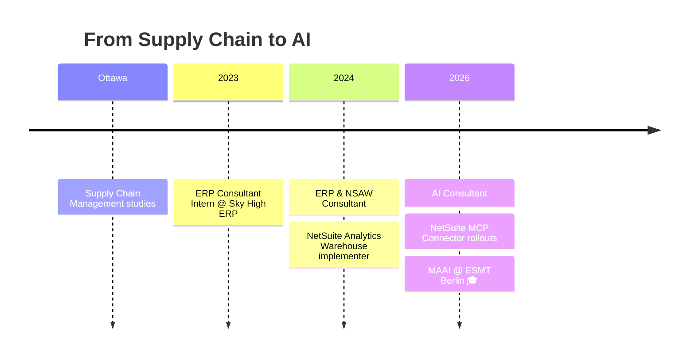

<!-- ===================== HEADER ===================== -->
<div align="center">


<br/>

[](https://www.linkedin.com/in/guillermo-morfin-guerrero)
[](mailto:morfin8032@gmail.com)


</div>

---

## 🧬 `whoami`

```python
class GuillermoMorfin:
    def __init__(self):
        self.location   = "Berlin, Germany 🇩🇪"
        self.roots      = ["Mexico 🇲🇽", "Spain 🇪🇸", "Canada 🇨🇦"]
        self.education  = {
            "current": "Master in Analytics & AI (MAAI) @ ESMT Berlin",
            "past":    "Supply Chain Management @ Ottawa",
        }
        self.experience = {
            "company": "Sky High ERP",
            "roles":   ["ERP Consultant", "NSAW Implementer", "AI Consultant"],
        }
        self.focus      = ["Applied AI", "Data Warehousing", "Business Analytics"]
        self.interests  = ["Energy ⚡", "AI Strategy 🧠", "Innovative Tech 🚀"]
        self.languages  = {"Spanish": "native", "English": "fluent"}

    def mission(self):
        return "Bridge business systems and AI to drive real-world impact."

me = GuillermoMorfin()
print(me.mission())
```

---

## 🛣️ Journey



---

## ⚡ Tech Stack

<div align="center">


<br/><br/>


</div>

---

## 🚀 Featured Projects

<table>
<tr>
<td width="50%" valign="top">

### 🔌 Project Name
Short description of the problem, what you built, and the impact.

`Python` `MCP` `AI`

[**→ View repo**](https://github.com/GuillermoMorfin/REPO)

</td>
<td width="50%" valign="top">

### 📊 Project Name
Short description of the problem, what you built, and the impact.

`R` `Statistics` `Tableau`

[**→ View repo**](https://github.com/GuillermoMorfin/REPO)

</td>
</tr>
<tr>
<td width="50%" valign="top">

### 💡 Project Name
Short description of the problem, what you built, and the impact.

`Python` `AI` `Innovation`

[**→ View repo**](https://github.com/GuillermoMorfin/REPO)

</td>
<td width="50%" valign="top">

### ⚡ Project Name
Short description of the problem, what you built, and the impact.

`Python` `Energy` `ML`

[**→ View repo**](https://github.com/GuillermoMorfin/REPO)

</td>
</tr>
</table>

> 🚧 More projects coming as I work through the MAAI program.

---

## 📈 GitHub Analytics

<div align="center">


</div>

---

## 🤝 Let's Connect

<div align="center">

Always up for a chat about **analytics, AI, ERP**, or a good **long run** 🏃‍♂️

[](https://www.linkedin.com/in/guillermo-morfin-guerrero)
[](mailto:morfin8032@gmail.com)


</div>
